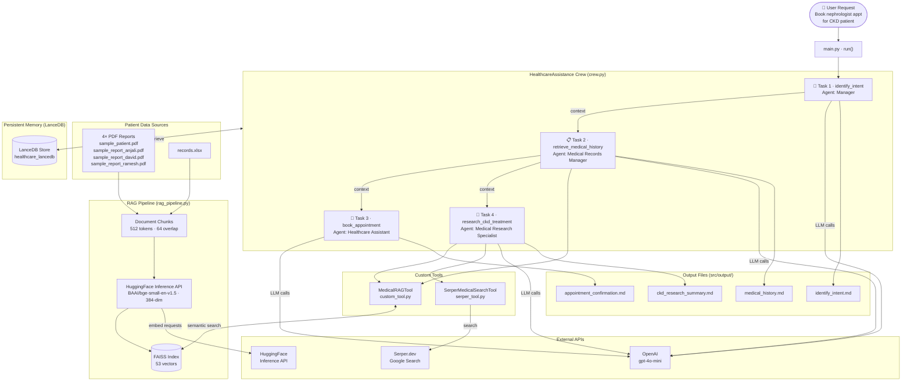

# Healthcare Assistance CrewAI Project — Complete Guide

---

## Table of Contents

1. [Project Overview](#1-project-overview)
2. [Initial Environment Setup](#2-initial-environment-setup)
3. [Scaffolding the CrewAI Project](#3-scaffolding-the-crewai-project)
4. [Repository Structure](#4-repository-structure)
5. [System Architecture Diagram](#5-system-architecture-diagram)
6. [Agents](#6-agents)
7. [Tasks](#7-tasks)
8. [RAG Pipeline](#8-rag-pipeline)
9. [Custom Tools](#9-custom-tools)
10. [Persistent Memory](#10-persistent-memory)
11. [Dependencies](#11-dependencies)
12. [Environment Variables](#12-environment-variables)
13. [Key Issues Resolved](#13-key-issues-resolved)
14. [Successful Execution Output](#14-successful-execution-output)
15. [How to Run](#15-how-to-run)

---

## 1. Project Overview

Transformed a debate-crew scaffold into a **multi-agent healthcare assistance system** using CrewAI 1.14.4. The system accepts a natural-language patient request and runs 4 sequential agents to identify intent, retrieve medical records via RAG, book an appointment, and research treatment options.

**Input request used for testing:**
> "Book a nephrologist appointment for my 70-year-old father who has been diagnosed with Chronic Kidney Disease (CKD)."

---

## 2. Initial Environment Setup

### Prerequisites

- **OS**: Debian GNU/Linux 13 (dev container)
- **Python**: 3.11+
- **pip**, **uv** (for crewai project management)
- API keys for OpenAI, HuggingFace, and optionally Serper.dev

### Step 1 — Run the Setup Script

```bash
bash setup_crewai.sh
```

This automated script:
- Checks Python installation
- Upgrades pip, setuptools, wheel
- Adds `~/.local/bin` to `PATH`
- Installs `crewai` and `crewai-tools`
- Installs all dependencies from `requirements.txt`
- Verifies the `crewai` CLI is available

### Step 2 — Verify Installation

```bash
python3 -c "import crewai; print(f'CrewAI version: {crewai.__version__}')"
crewai --version
```

If the `crewai` CLI binary is not found immediately after install, refresh the shell hash cache:

```bash
hash -r
# then retry:
which crewai
```

The binary is typically at `/home/<user>/.local/bin/crewai` or `/home/<user>/.python/current/bin/crewai`.

### Step 3 — Install All Project Dependencies

```bash
pip install -r requirements.txt
```

`requirements.txt` includes everything needed to run the project end-to-end (see [Dependencies](#11-dependencies)).

### Step 4 — Configure API Keys

Copy `.env` (already in the repo as a template) to fill in your real keys:

```bash
# healthcareassistance/.env
OPENAI_API_KEY=sk-...
HUGGINGFACEHUB_API_TOKEN=hf_...
HF_TOKEN=hf_...
SERPER_API_KEY=your-serper-key-here   # optional
```

---

## 3. Scaffolding the CrewAI Project

The `healthcareassistance/` project was scaffolded using the CrewAI CLI:

```bash
cd /workspaces/Simplilearn_Agentic_AI
crewai create crew healthcareassistance
```

The CLI prompted for:
1. **LLM Provider** — `openai`
2. **Model name** — `gpt-4o-mini`

Generated structure (before customisation):

```
healthcareassistance/
├── .env
├── .gitignore
├── AGENTS.md
├── README.md
├── knowledge/
│   └── user_preference.txt
├── pyproject.toml
└── src/healthcare_app/
    ├── __init__.py
    ├── crew.py
    ├── main.py
    ├── config/
    │   ├── agents.yaml
    │   └── tasks.yaml
    └── tools/
        ├── __init__.py
        └── custom_tool.py
```

---

## 4. Repository Structure

```
healthcareassistance/
├── .env                                    ← API keys template (credentials replaced)
├── .gitignore                              ← Excludes .venv, memory/, faiss_index/, output/
├── AGENTS.md                               ← CrewAI coding reference for AI assistants
├── PROJECT_SUMMARY.md                      ← This file
├── README.md                               ← CrewAI project README
├── pyproject.toml                          ← Dependencies managed by uv
├── uv.lock                                 ← Locked dependency versions
├── knowledge/
│   └── user_preference.txt
└── src/healthcare_app/
    ├── __init__.py
    ├── crew.py                             ← Crew definition: agents, tasks, tools, memory
    ├── main.py                             ← Entry point
    ├── config/
    │   ├── agents.yaml                     ← 4 agent definitions
    │   └── tasks.yaml                      ← 4 sequential task definitions
    ├── patient_data/
    │   ├── records.xlsx                    ← Structured patient records
    │   ├── sample_patient.pdf              ← 11-page patient chart
    │   ├── sample_report_anjali.pdf        ← Upper Respiratory Infection report
    │   ├── sample_report_david.pdf         ← Type 2 Diabetes follow-up
    │   ├── sample_report_ramesh.pdf        ← Essential Hypertension report
    │   └── requirements.txt               ← Patient data pipeline deps
    └── tools/
        ├── __init__.py
        ├── custom_tool.py                  ← MedicalRAGTool (FAISS semantic search)
        ├── rag_pipeline.py                 ← FAISS index build + load
        └── serper_tool.py                  ← SerperMedicalSearchTool (web search)
```

---

## 5. System Architecture Diagram

![Healthcare Assistance CrewAI — System Architecture](https://mermaid.ink/img/Zmxvd2NoYXJ0IFRECiAgICBVc2VyKFsi8J-RpCBVc2VyIFJlcXVlc3QKQm9vayBuZXBocm9sb2dpc3QgYXBwdApmb3IgQ0tEIHBhdGllbnQiXSkKICAgIFVzZXIgLS0-IE1QWyJtYWluLnB5IMK3IHJ1bigpIl0KICAgIHN1YmdyYXBoIENyZXdbIkhlYWx0aGNhcmVBc3Npc3RhbmNlIENyZXcgIGNyZXcucHkiXQogICAgICAgIGRpcmVjdGlvbiBUQgogICAgICAgIFQxWyLwn46vIFRhc2sgMSDCtyBpZGVudGlmeV9pbnRlbnQKQWdlbnQ6IE1hbmFnZXIiXQogICAgICAgIFQyWyLwn5OLIFRhc2sgMiDCtyByZXRyaWV2ZV9tZWRpY2FsX2hpc3RvcnkKQWdlbnQ6IE1lZGljYWwgUmVjb3JkcyBNYW5hZ2VyIl0KICAgICAgICBUM1si8J-ThSBUYXNrIDMgwrcgYm9va19hcHBvaW50bWVudApBZ2VudDogSGVhbHRoY2FyZSBBc3Npc3RhbnQiXQogICAgICAgIFQ0WyLwn5SsIFRhc2sgNCDCtyByZXNlYXJjaF9ja2RfdHJlYXRtZW50CkFnZW50OiBNZWRpY2FsIFJlc2VhcmNoIFNwZWNpYWxpc3QiXQogICAgICAgIFQxIC0tPnxjb250ZXh0fCBUMgogICAgICAgIFQyIC0tPnxjb250ZXh0fCBUMwogICAgICAgIFQyIC0tPnxjb250ZXh0fCBUNAogICAgZW5kCiAgICBNUCAtLT4gVDEKICAgIHN1YmdyYXBoIFRvb2xzWyJDdXN0b20gVG9vbHMiXQogICAgICAgIFJBR1Rvb2xbIk1lZGljYWxSQUdUb29sCmN1c3RvbV90b29sLnB5Il0KICAgICAgICBTZXJwZXJUb29sWyJTZXJwZXJNZWRpY2FsU2VhcmNoVG9vbApzZXJwZXJfdG9vbC5weSJdCiAgICBlbmQKICAgIFQyIC0tPiBSQUdUb29sCiAgICBUNCAtLT4gUkFHVG9vbAogICAgVDQgLS0-IFNlcnBlclRvb2wKICAgIHN1YmdyYXBoIFJBR1BpcGVsaW5lWyJSQUcgUGlwZWxpbmUgIHJhZ19waXBlbGluZS5weSJdCiAgICAgICAgQ2h1bmtzWyJEb2N1bWVudCBDaHVua3MKNTEyIHRva2VucyDCtyA2NCBvdmVybGFwIl0KICAgICAgICBIRkVtYmVkWyJIdWdnaW5nRmFjZSBJbmZlcmVuY2UgQVBJCkJBQUkvYmdlLXNtYWxsLWVuLXYxLjUgwrcgMzg0LWRpbSJdCiAgICAgICAgRkFJU1NJZHhbKCJGQUlTUyBJbmRleAo1MyB2ZWN0b3JzIildCiAgICBlbmQKICAgIHN1YmdyYXBoIFBhdGllbnREYXRhWyJQYXRpZW50IERhdGEgU291cmNlcyJdCiAgICAgICAgUERGc1siNHggUERGIFJlcG9ydHMKc2FtcGxlX3BhdGllbnQucGRmCnNhbXBsZV9yZXBvcnRfYW5qYWxpLnBkZgpzYW1wbGVfcmVwb3J0X2RhdmlkLnBkZgpzYW1wbGVfcmVwb3J0X3JhbWVzaC5wZGYiXQogICAgICAgIEV4Y2VsWyJyZWNvcmRzLnhsc3giXQogICAgZW5kCiAgICBQREZzICYgRXhjZWwgLS0-IENodW5rcwogICAgQ2h1bmtzIC0tPiBIRkVtYmVkIC0tPiBGQUlTU0lkeAogICAgUkFHVG9vbCA8LS0-fHNlbWFudGljIHNlYXJjaHwgRkFJU1NJZHgKICAgIHN1YmdyYXBoIE1lbW9yeVsiUGVyc2lzdGVudCBNZW1vcnkgIExhbmNlREIiXQogICAgICAgIExhbmNlREJbKCJMYW5jZURCIFN0b3JlCmhlYWx0aGNhcmVfbGFuY2VkYiIpXQogICAgZW5kCiAgICBDcmV3IDwtLT58c2F2ZSAvIHJldHJpZXZlfCBMYW5jZURCCiAgICBzdWJncmFwaCBFeHRBUElzWyJFeHRlcm5hbCBBUElzIl0KICAgICAgICBPcGVuQUlbIk9wZW5BSQpncHQtNG8tbWluaSJdCiAgICAgICAgSEZJbmZlcmVuY2VbIkh1Z2dpbmdGYWNlCkluZmVyZW5jZSBBUEkiXQogICAgICAgIFNlcnBlckFQSVsiU2VycGVyLmRldgpHb29nbGUgU2VhcmNoIl0KICAgIGVuZAogICAgVDEgJiBUMiAmIFQzICYgVDQgLS0-fExMTSBjYWxsc3wgT3BlbkFJCiAgICBIRkVtYmVkIC0tPnxlbWJlZCByZXF1ZXN0c3wgSEZJbmZlcmVuY2UKICAgIFNlcnBlclRvb2wgLS0-fHNlYXJjaHwgU2VycGVyQVBJCiAgICBzdWJncmFwaCBPdXRwdXRzWyJPdXRwdXQgRmlsZXMgIHNyYy9vdXRwdXQvIl0KICAgICAgICBPMVsiaWRlbnRpZnlfaW50ZW50Lm1kIl0KICAgICAgICBPMlsibWVkaWNhbF9oaXN0b3J5Lm1kIl0KICAgICAgICBPM1siYXBwb2ludG1lbnRfY29uZmlybWF0aW9uLm1kIl0KICAgICAgICBPNFsiY2tkX3Jlc2VhcmNoX3N1bW1hcnkubWQiXQogICAgZW5kCiAgICBUMSAtLT4gTzEKICAgIFQyIC0tPiBPMgogICAgVDMgLS0-IE8zCiAgICBUNCAtLT4gTzQ=)



---

## 6. Agents

### Agent Definitions (`config/agents.yaml`)

| Agent Key | Role | LLM | Tools |
|---|---|---|---|
| `manager` | Healthcare Operations and Case Manager | openai/gpt-4o-mini | — |
| `medical_records_manager` | Senior Medical Records Manager | openai/gpt-4o-mini | MedicalRAGTool |
| `medical_research_specialist` | Senior Medical Research Specialist | openai/gpt-4o-mini | MedicalRAGTool, SerperMedicalSearchTool |
| `healthcare_assistant` | Healthcare Scheduling Assistant | openai/gpt-4o-mini | — |

## 7. Tasks

### Task Definitions (`config/tasks.yaml`)

| # | Task | Agent | Context From | Output File |
|---|---|---|---|---|
| 1 | `identify_intent` | manager | _(input: `{user_request}`)_ | `output/identify_intent.md` |
| 2 | `retrieve_medical_history` | medical_records_manager | identify_intent | `output/medical_history.md` |
| 3 | `book_appointment` | healthcare_assistant | retrieve_medical_history | `output/appointment_confirmation.md` |
| 4 | `research_ckd_treatment` | medical_research_specialist | retrieve_medical_history | `output/ckd_research_summary.md` |

---

## 8. RAG Pipeline

### Embedding Model
- **Model:** `BAAI/bge-small-en-v1.5` (384-dim, MIT license)
- **Provider:** HuggingFace Inference API via `HuggingFaceEndpointEmbeddings` from `langchain-huggingface`
- **No local model download** — API-based, avoids PyTorch/sentence-transformers disk usage (~2GB saved)
- **Requires:** `HUGGINGFACEHUB_API_TOKEN` in `.env`

### Vector Store
- **Backend:** FAISS (`faiss-cpu`)
- **Index location:** `src/healthcare_app/patient_data/faiss_index/`
- **Vectors:** 53 (built from 22 document pages/rows, chunked at size=512, overlap=64)

### Data Sources (`src/healthcare_app/patient_data/`)
| File | Type | Content |
|---|---|---|
| `sample_patient.pdf` | PDF | 11-page patient chart (Bridport Family Medicine) |
| `sample_report_anjali.pdf` | PDF | Upper Respiratory Infection report |
| `sample_report_david.pdf` | PDF | Type 2 Diabetes follow-up (David Thompson) |
| `sample_report_ramesh.pdf` | PDF | Essential Hypertension report (Ramesh) |
| `records.xlsx` | Excel | Structured patient records |

### Rebuilding the Index
```bash
cd healthcareassistance
set -a && source .env && set +a
rm -rf src/healthcare_app/patient_data/faiss_index
cd src && python3 -m healthcare_app.tools.rag_pipeline
```

---

## 9. Custom Tools

### `MedicalRAGTool` (`tools/custom_tool.py`)
- CrewAI `BaseTool` wrapping FAISS semantic search
- Class-level `_vectorstore` cache (loads once per process)
- Accepts `query` + optional `top_k` (default 5)
- Returns formatted chunks with source file and page number

### `SerperMedicalSearchTool` (`tools/serper_tool.py`)
- Calls Serper.dev Google Search API
- Filters results to trusted medical domains: WHO, PubMed, Medline, Mayo Clinic, CDC, NHS, kidney.org
- Used only by `medical_research_specialist` (Task 4)
- Handles missing `SERPER_API_KEY` gracefully (returns a message instead of crashing)

---

## 10. Persistent Memory (`crew.py`)

Uses CrewAI 1.14.4's unified `Memory` class with `LanceDBStorage`:

```python
from crewai.memory.unified_memory import Memory
from crewai.memory.storage.lancedb_storage import LanceDBStorage

memory = Memory(
    storage=LanceDBStorage(
        path="./memory/healthcare_lancedb",
        table_name="healthcare_memories",
    ),
    embedder={"provider": "openai", "config": {"model": "text-embedding-3-small"}},
    semantic_weight=0.6,
    recency_half_life_days=90,
    default_importance=0.7,
)
```

> **Note:** The old `LongTermMemory` / `ShortTermMemory` / `EntityMemory` classes were removed in crewai 1.x. The unified `Memory` + `LanceDBStorage` approach is correct for 1.14.4.

---

## 11. Dependencies

### `pyproject.toml` (used by `crewai run` via isolated `uv` venv)

```toml
dependencies = [
    "crewai[tools]==1.14.4",
    "faiss-cpu>=1.7.4",
    "huggingface-hub>=0.23.0",
    "langchain-huggingface>=0.1.0",
    "langchain-community>=0.2.0",
    "langchain-core>=0.2.0",
    "langchain-text-splitters>=0.2.0",
    "pypdf>=4.0.0",
    "openpyxl>=3.1.0",
    "pandas>=2.0.0",
    "requests>=2.31.0",
]
```

### `requirements.txt` (used by `pip install -r requirements.txt` for system-level setup)

```
crewai[tools]>=1.14.4
crewai-tools>=1.0.0
langchain>=0.2.0
langchain-community>=0.2.0
langchain-core>=0.2.0
langchain-text-splitters>=0.2.0
pydantic>=2.0.0
openai>=1.0.0
python-dotenv>=1.0.0
pandas>=2.0.0
numpy>=1.24.0
openpyxl>=3.1.0
requests>=2.31.0
aiohttp>=3.9.0
faiss-cpu>=1.7.4
huggingface-hub>=0.23.0
langchain-huggingface>=0.1.0
pypdf>=4.0.0
lancedb>=0.6.0
```

**Intentionally excluded:** `sentence-transformers`, `torch` (PyTorch) — these consume ~2GB+ disk space, causing disk-full failures. The project uses the HuggingFace Inference API instead (no local model download).

---

## 12. Environment Variables (`.env`)

| Variable | Purpose |
|---|---|
| `OPENAI_API_KEY` | LLM calls (gpt-4o-mini) for all agents |
| `HUGGINGFACEHUB_API_TOKEN` | HuggingFace Inference API for FAISS embeddings |
| `HF_TOKEN` | Alias for HF token (some libraries read this) |
| `SERPER_API_KEY` | Serper.dev Google Search (set to placeholder — tool handles gracefully) |

---

## 13. Key Issues Resolved

| # | Problem | Solution |
|---|---|---|
| 1 | `langchain.schema.Document` removed in LangChain 1.x | Changed to `langchain_core.documents` |
| 2 | `langchain.text_splitter` removed | Changed to `langchain_text_splitters` |
| 3 | `HuggingFaceEmbeddings` deprecated | Switched to `HuggingFaceEndpointEmbeddings` from `langchain-huggingface` |
| 4 | `LongTermMemory`/`ShortTermMemory`/`EntityMemory` don't exist in crewai 1.14.4 | Replaced with unified `Memory` + `LanceDBStorage` |
| 5 | `crewai run` uses isolated `uv` venv — system-installed packages unavailable | Added all deps to `pyproject.toml` |
| 6 | `sentence-transformers` pulls PyTorch (~2GB) → disk full | Removed sentence-transformers; switched to HF Inference API |
| 7 | OpenAI API key returning 401 for embeddings | Switched FAISS embeddings to HuggingFace Inference API |
| 8 | `agents.yaml` had leading-whitespace indentation bug | Fixed all 4 agent keys to correct indentation |
| 9 | `agents.yaml` had invalid `tools:` block | Removed (tools are wired in `crew.py`, not YAML) |
| 10 | `langchain-community` missing from `pyproject.toml` | Added `langchain-community>=0.2.0` to dependencies |
| 11 | `load_index()` in `rag_pipeline.py` still used `OpenAIEmbeddings` | Fixed to `HuggingFaceEndpointEmbeddings` |

---

## 14. Successful Execution Output

```
╭─────────────────── 🚀 Crew Execution Started ──────────────────╮
│  Name: HealthcareAssistance                                    │
╰────────────────────────────────────────────────────────────────╯

Task 1 (identify_intent) ✅
  Agent: Healthcare Operations and Case Manager
  Output:
    - Patient intent: book an appointment
    - Specialist required: Nephrologist
    - Patient details: 70-year-old father with Chronic Kidney Disease (CKD)
    - Sub-tasks delegated to: Medical Records Manager, Healthcare Scheduler,
      Medical Research Specialist

Task 2 (retrieve_medical_history) ✅
  Agent: Senior Medical Records Manager
  Tool calls: 10× medical_rag_search (queried FAISS index)
  Retrieved real patient data from: sample_patient.pdf, sample_report_ramesh.pdf,
  sample_report_david.pdf, records.xlsx

Task 3 (book_appointment) ✅
  Agent: Healthcare Scheduling Assistant

Task 4 (research_ckd_treatment) ✅
  Agent: Senior Medical Research Specialist
  Final output: Comprehensive CKD management and treatment guide

╭──────────────────── 🏁 Crew Execution Complete ────────────────╮
│  Exit code: 0                                                  │
╰────────────────────────────────────────────────────────────────╯
```

**Packages installed in isolated venv:** 162 (including all langchain stack, crewai, faiss-cpu, lancedb, etc. — no PyTorch)

---

## 15. How to Run

### Prerequisites

1. Python 3.10–3.13 installed
2. API keys ready (OpenAI, HuggingFace)
3. Clone the repo and switch to the feature branch:
   ```bash
   git clone https://github.com/goumze/Simplilearn_Agentic_AI.git
   cd Simplilearn_Agentic_AI
   git checkout feature/simplilearn_capstone_1
   ```

### Step 1 — Run the setup script (first time only)

```bash
bash setup_crewai.sh
```

Or install manually:

```bash
pip install -r requirements.txt
```

### Step 2 — Configure credentials

```bash
cd healthcareassistance
# Edit .env and fill in your real API keys
nano .env
```

Required keys:
- `OPENAI_API_KEY` — LLM calls (gpt-4o-mini)
- `HUGGINGFACEHUB_API_TOKEN` / `HF_TOKEN` — FAISS embeddings via HF Inference API
- `SERPER_API_KEY` — optional (web search in Task 4; gracefully skipped if missing)

### Step 3 — Build FAISS index (first time only)

```bash
cd healthcareassistance
set -a && source .env && set +a
cd src && python3 -m healthcare_app.tools.rag_pipeline && cd ..
```

Expected output: `FAISS index saved — 53 vectors (BAAI/bge-small-en-v1.5)`

To rebuild from scratch:
```bash
rm -rf src/healthcare_app/patient_data/faiss_index
# then re-run the command above
```

### Step 4 — Run the crew

```bash
cd healthcareassistance
set -a && source .env && set +a
mkdir -p src/output memory
crewai run
```

`crewai run` spins up an isolated `uv` venv using `pyproject.toml`, then executes all 4 tasks sequentially.

### Output files

After a successful run, results are written to:

| File | Contents |
|---|---|
| `src/output/identify_intent.md` | Parsed intent, specialist type, sub-task plan |
| `src/output/medical_history.md` | Retrieved patient records from FAISS |
| `src/output/appointment_confirmation.md` | Booking details |
| `src/output/ckd_research_summary.md` | CKD treatment research summary |

### Resetting memory

```bash
crewai reset-memories -a   # reset all LanceDB memories
```
