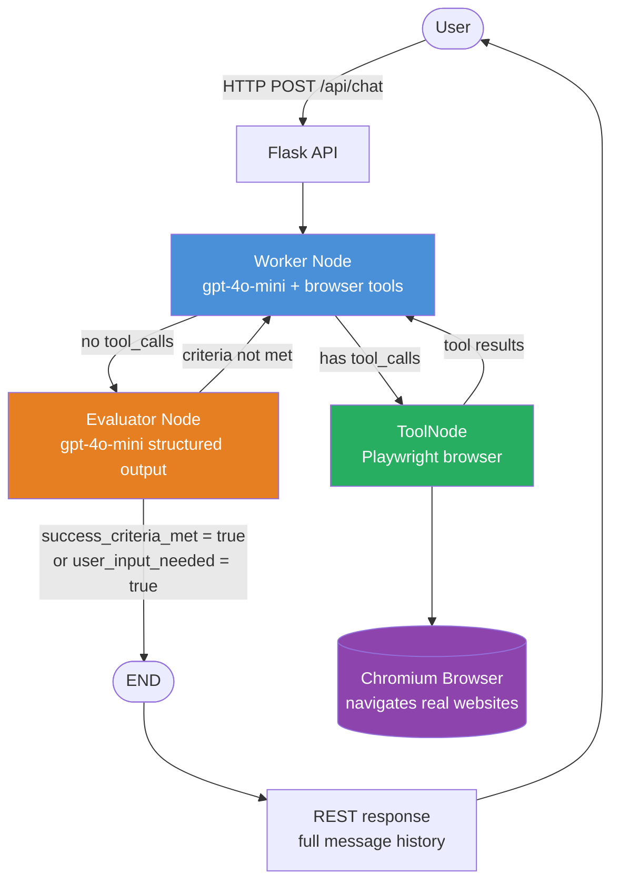
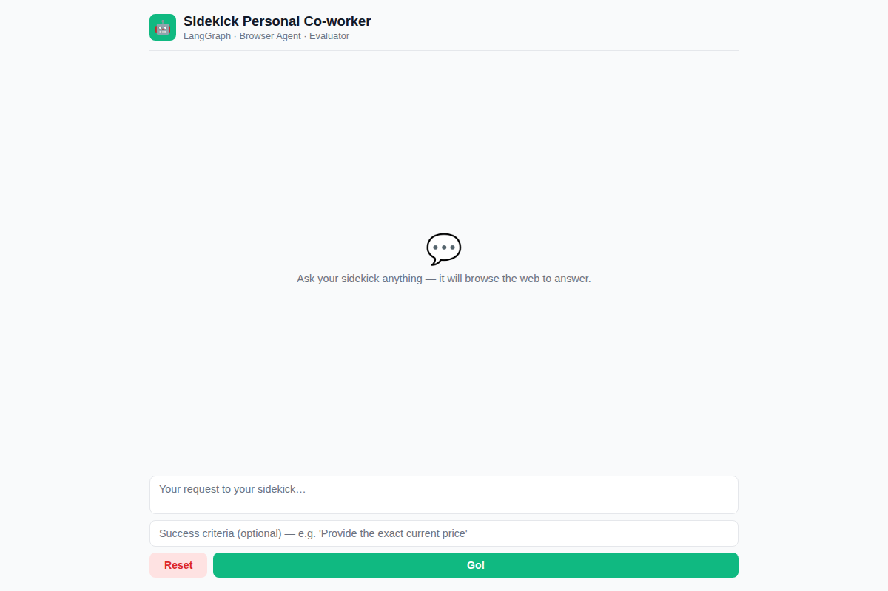
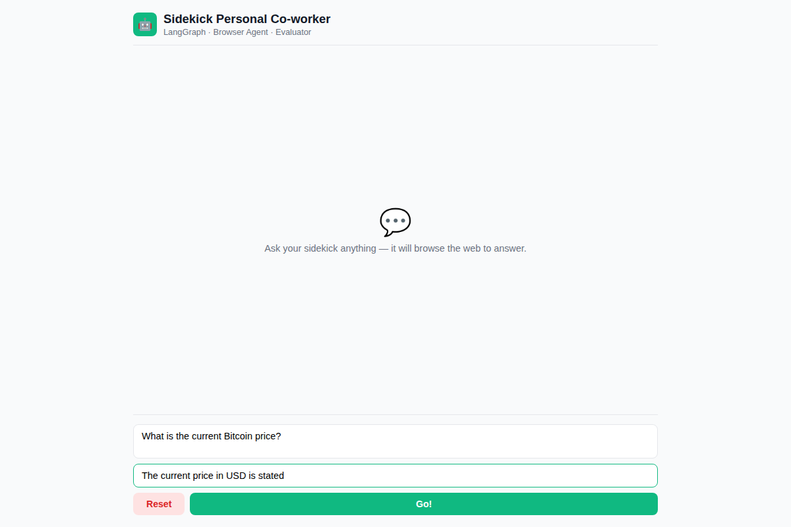
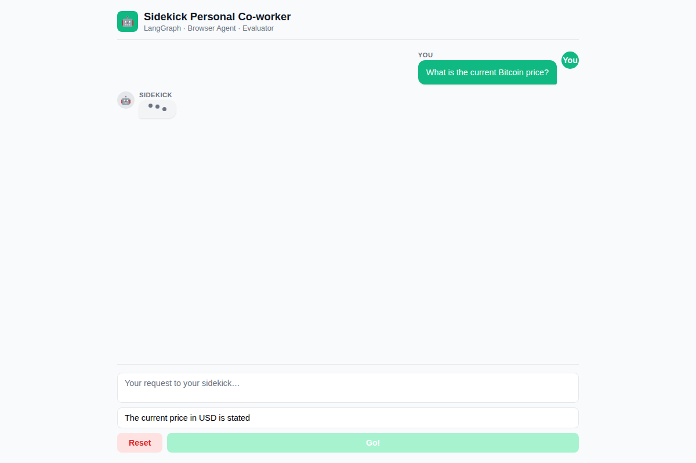
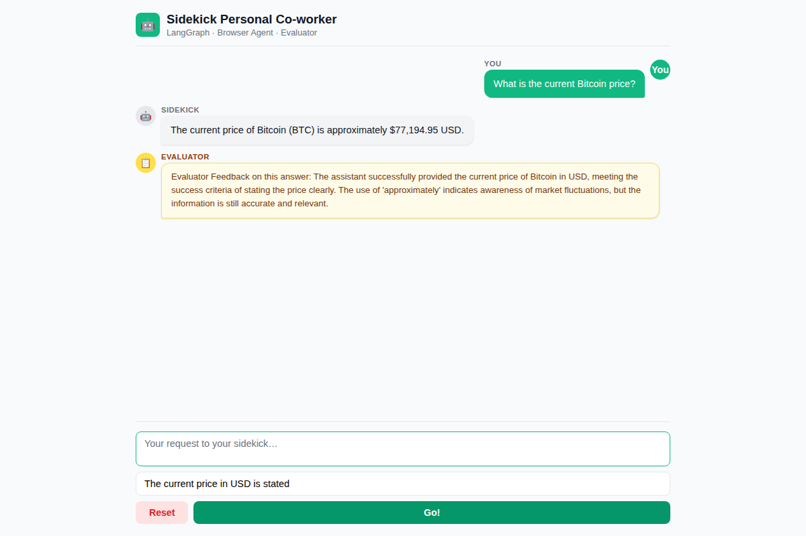

# Sidekick — Agentic AI Personal Co-worker

A LangGraph-powered agentic AI assistant that uses a real Chromium browser to answer questions about live data (weather, prices, news, etc.). Built with Flask, LangGraph, OpenAI `gpt-4o-mini`, Playwright, and LangSmith observability.

---

## Architecture Overview

```
User Browser  ──►  Flask (/:UI  /api/chat  /api/reset  /health)
                         │
                         ▼
              ┌─── LangGraph StateGraph ───────────────────────────┐
              │                                                     │
              │   START ──► worker ──► tools ──► worker            │
              │                 │                   │              │
              │                 └──────────────────►│              │
              │                                     ▼              │
              │                               evaluator            │
              │                                     │              │
              │              criteria met? ──YES──► END            │
              │                   │                                │
              │                   NO ──────────────► worker        │
              └─────────────────────────────────────────────────── ┘
                         │
                         ▼
            Playwright Chromium (headless)
            Browses real websites for live data
```

### Full Workflow Diagram



### State Machine

| Node | Role | LLM |
|---|---|---|
| **worker** | Executes tasks using browser tools; browses real sites for live data | `gpt-4o-mini` + Playwright tools |
| **tools** | `ToolNode` — runs Playwright calls (`navigate_browser`, `extract_text`, `get_elements`, `click_element`, `current_page`) | *(tool executor)* |
| **evaluator** | Judges if the worker's reply meets the `success_criteria`; decides to loop or end | `gpt-4o-mini` with structured `EvaluatorOutput` |

---

## Tech Stack

| Layer | Technology |
|---|---|
| Web Framework | Flask |
| Agent Graph | LangGraph `StateGraph` with `MemorySaver` checkpointer |
| LLM | OpenAI `gpt-4o-mini` |
| Browser Automation (agent) | Playwright async API (`PlayWrightBrowserToolkit`) |
| Browser Automation (tests) | Playwright sync API |
| Observability | LangSmith tracing |
| UI | Vanilla HTML/CSS/JS (`templates/index.html`) |
| Tests | `test_app.py` (API) + `test_ui.py` (UI) |

---

## Project Structure

```
Simplilearn_Agentic_AI/
├── main.py              # Flask app + LangGraph agent definition
├── templates/
│   └── index.html       # Single-page chat UI
├── test_app.py          # REST API integration tests (7 tests)
├── test_ui.py           # Playwright UI end-to-end tests (7 tests)
├── run.sh               # One-shot: install → start server → API tests → VNC → UI tests
├── requirements.txt     # Python dependencies
├── .env.example         # Environment variable template (no secrets)
└── .env                 # Local secrets — gitignored
```

---

## Setup

```bash
# 1. Clone and enter the repo
git clone https://github.com/goumze/Simplilearn_Agentic_AI.git
cd Simplilearn_Agentic_AI

# 2. Copy env template and fill in your keys
cp .env.example .env
# Edit .env — add OPENAI_API_KEY and LANGCHAIN_API_KEY

# 3. Run everything (installs deps, starts server, runs all tests, opens live VNC view)
bash run.sh
```

---

## API Reference

| Method | Endpoint | Description |
|---|---|---|
| `GET` | `/health` | Health check — returns `{"status": "ok"}` |
| `GET` | `/` | Serves the chat UI |
| `POST` | `/api/chat` | Send a message to the agent |
| `POST` | `/api/reset` | Start a fresh conversation thread |

### POST `/api/chat` — Request body

```json
{
  "message": "What is the current Bitcoin price?",
  "success_criteria": "The current price in USD is stated",
  "history": [],
  "thread_id": "optional-uuid"
}
```

---

## Test Coverage

### API Tests (`test_app.py`) — 7 tests

| # | Test | What it validates |
|---|---|---|
| 1 | **Health check** | `GET /health` returns `{"status": "ok"}` |
| 2 | **Reset endpoint** | `POST /api/reset` returns a new `thread_id` |
| 3 | **Missing message → 400** | Empty POST body is rejected with HTTP 400 |
| 4 | **London weather query** | Agent browses a weather site and returns temperature/conditions |
| 5 | **BBC News headline** | Agent navigates bbc.com and returns the current top headline |
| 6 | **Bitcoin price** | Agent fetches live BTC/USD price from a finance site |
| 7 | **Multi-turn conversation** | Two-turn thread: ETH price, then comparison with BTC |

### UI Tests (`test_ui.py`) — 7 tests (Playwright, headed browser)

| # | Test | What it validates |
|---|---|---|
| UI-1 | **Page load & structure** | Title, header, empty state, input controls all present |
| UI-2 | **Go button disables while busy** | Button is disabled during agent processing and re-enables on reply |
| UI-3 | **User bubble appears immediately** | Message bubble renders before the LLM responds; input clears |
| UI-4 | **Assistant & evaluator bubbles** | Full round-trip: assistant reply + evaluator feedback both rendered |
| UI-5 | **Enter key submits message** | Pressing Enter (without Shift) triggers submission |
| UI-6 | **Reset clears the chat** | Reset button wipes messages and restores the empty state |
| UI-7 | **Shift+Enter inserts newline** | Shift+Enter adds a line break and does NOT submit |

---

## Live Playwright Browser View (noVNC)

`run.sh` launches a **headed Chromium** browser on a virtual display (Xvfb) and streams it live over VNC so you can watch every Playwright action in real time.

**How it works:**

```
Playwright (headless=False, slow_mo=800ms)
        │
        ▼
  Xvfb :99 (virtual display 1280×900)
        │
        ▼
  x11vnc (VNC server → port 5900)
        │
        ▼
  noVNC + websockify (WebSocket proxy → port 6080)
        │
        ▼
  Browser: http://localhost:6080/vnc.html
```

Once `run.sh` prints:

```
===> Open http://localhost:6080/vnc.html in the PORTS panel to watch Playwright LIVE <==
```

Open **VS Code → PORTS panel → port 6080 → Open in Browser** to see the tests running live.

### Screenshots

The sequence below is captured from a live `run.sh` run.

**1. Sidekick UI loads — empty state**



**2. User types a message — bubble appears immediately**



**3. Typing indicator while the LangGraph agent is browsing**



**4. Assistant reply + Evaluator feedback rendered**



> Screenshots are captured by the noVNC viewer during `test_ui.py` execution.  
> Run `bash run.sh` and watch port 6080 to see these actions live.

---

## LangSmith Observability

Every agent run is traced automatically when `LANGCHAIN_TRACING_V2=true` is set in `.env`.

Traces are visible at [smith.langchain.com](https://smith.langchain.com) under the project name set in `LANGCHAIN_PROJECT` (default: `sidekick-agent`). Each trace shows the full node-by-node execution: worker → tools → evaluator, with token counts and latency.

---

## Environment Variables

| Variable | Required | Description |
|---|---|---|
| `OPENAI_API_KEY` | ✅ | OpenAI API key for `gpt-4o-mini` |
| `LANGCHAIN_TRACING_V2` | optional | Set to `true` to enable LangSmith tracing |
| `LANGCHAIN_API_KEY` | optional | LangSmith API key |
| `LANGCHAIN_PROJECT` | optional | LangSmith project name (default: `sidekick-agent`) |
| `LANGCHAIN_ENDPOINT` | optional | LangSmith API endpoint |

