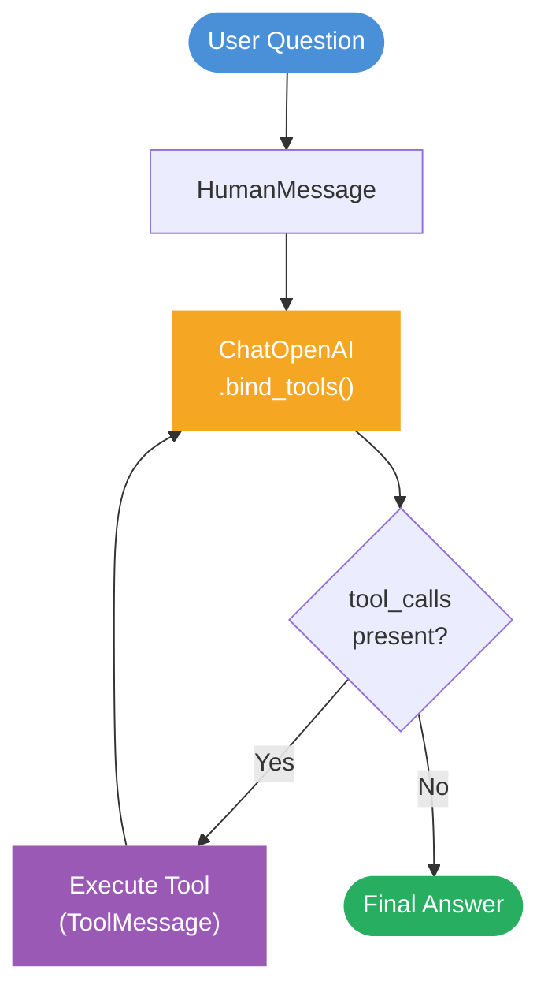
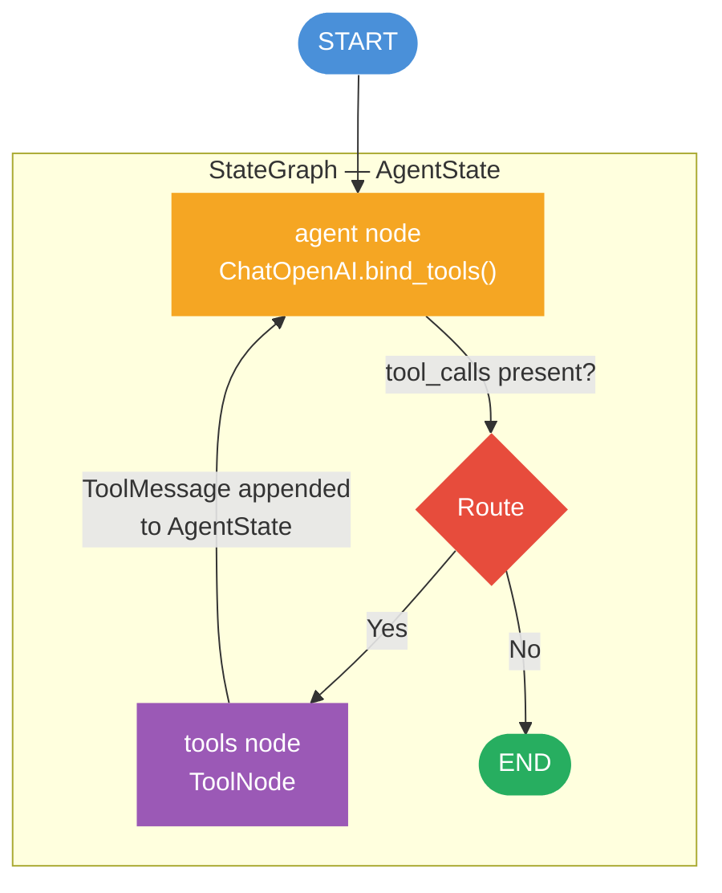
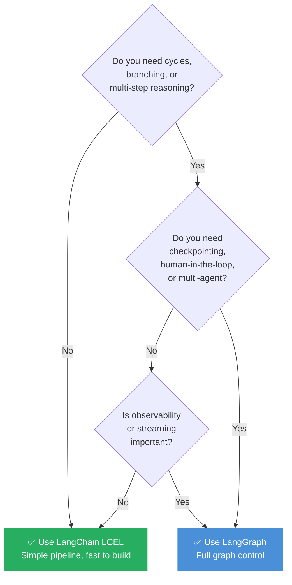

# Simplilearn — Agentic AI Projects

Python projects learnt from Simplilearn, exploring agentic AI frameworks.

---

## Repository Structure

```
.
├── .env                    # Shared OpenAI API key (git-ignored)
├── run_outcomes.md         # Recorded test-run results for both projects
├── langchain_project/      # Q&A agent built with LangChain 1.x (LCEL)
│   ├── agent.py
│   ├── tools.py
│   ├── requirements.txt
│   └── run.sh
└── langgraph_project/      # Q&A agent built with LangGraph (StateGraph)
    ├── agent.py
    ├── tools.py
    ├── requirements.txt
    └── run.sh
```

---

## The Project — Q&A Agent with Tool Use

Both projects implement the **same Q&A agent** that answers natural-language
questions by calling one of four tools:

| Tool | Purpose |
|------|---------|
| `calculator` | Safely evaluates mathematical expressions via Python `ast` |
| `get_current_date` | Returns the current date and time |
| `knowledge_base_lookup` | Looks up topics from an in-memory knowledge base |
| `word_counter` | Counts words in a given piece of text |

**Six predefined test cases** exercise all four tools automatically when you
run either project.

### Quick start

```bash
# 1. Fill in your key in the shared .env
echo "OPENAI_API_KEY=sk-..." > .env

# 2. Run LangChain version
bash langchain_project/run.sh

# 3. Run LangGraph version
bash langgraph_project/run.sh
```

---

## Project 1 — LangChain LCEL Agent

### Description

Uses **LangChain 1.x** with the modern *LangChain Expression Language* (LCEL)
pattern. The agent is a plain Python function that drives a tool-calling loop:

1. Wrap the LLM with `llm.bind_tools(tools)` so the model knows which tools exist.
2. Send the user's question as a `HumanMessage`.
3. If the LLM response contains `tool_calls`, execute each tool, append a
   `ToolMessage`, and call the LLM again.
4. When the LLM returns a plain text response (no tool calls), that is the
   final answer.

There is no external orchestrator — the loop is just a `for` statement in
Python, making the control flow fully transparent.

### Architecture diagram



### Key concepts

- `@tool` decorator from `langchain_core.tools`
- `llm.bind_tools()` to register tools with the model
- `HumanMessage` / `AIMessage` / `ToolMessage` from `langchain_core.messages`
- Imperative Python loop — no framework orchestration overhead

---

## Project 2 — LangGraph StateGraph Agent

### Description

Uses **LangGraph** to model the same workflow as a **directed cyclic graph**.
Nodes are discrete processing units; edges (including conditional ones) control
routing. The shared state (`AgentState`) is a typed dictionary that accumulates
messages across every node traversal.

1. `START → agent node` — LLM decides whether to call a tool.
2. `agent → tools node` (conditional) — if `tool_calls` present, `ToolNode`
   dispatches the tool and appends a `ToolMessage` to state.
3. `tools → agent` (back-edge) — graph loops back so the LLM can respond to
   the tool result.
4. `agent → END` — when no tool calls are requested, the graph terminates.

The compiled graph is a **runnable** that can be streamed step-by-step, paused,
checkpointed, or extended with additional nodes without touching existing logic.

### Architecture diagram



### Key concepts

- `StateGraph` + `TypedDict` for explicit, inspectable state
- `ToolNode` from `langgraph.prebuilt` for automatic tool dispatch
- `add_conditional_edges` for dynamic routing
- `graph.compile()` produces a portable, streamable runnable
- `app.stream()` yields each graph step — full observability

---

## How They Differ in Agentic Orchestration

| Dimension | LangChain (LCEL) | LangGraph (StateGraph) |
|-----------|-----------------|------------------------|
| **Orchestration model** | Imperative Python loop | Declarative directed graph |
| **State** | Local variable inside a function | Shared `TypedDict` — external & inspectable |
| **Control flow** | `if/else` + `for` in Python code | Nodes + conditional edges in the graph |
| **Cycles** | Implicit (`for` loop with max iterations) | Explicit `tools → agent` back-edge |
| **Streaming** | Not built-in (manual printing) | `app.stream()` — native step-by-step events |
| **Parallelism** | Manual (e.g. `asyncio`) | Native parallel node execution |
| **Checkpointing** | Not available | Built-in via `MemorySaver` / persistent stores |
| **Human-in-the-loop** | Requires custom wiring | First-class `interrupt_before` / `interrupt_after` |
| **Multi-agent** | Manual function calls | Separate subgraph nodes with shared state |
| **Extensibility** | Add more `if/else` branches | Add nodes/edges without touching existing logic |

---

## Benefits & Limitations

### LangChain (LCEL)

#### ✅ Benefits

- **Simple mental model** — the tool-calling loop is plain Python; no new
  abstractions to learn beyond `bind_tools` and message types.
- **Low overhead** — no graph compilation step; suitable for
  lightweight, single-turn pipelines.
- **Readable** — the entire agent fits in ~30 lines of straightforward code.
- **Composable** — chains can be piped with `|` (LCEL pipe operator) to
  build complex prompt pipelines concisely.
- **Wide ecosystem** — hundreds of integrations (vector stores, retrievers,
  document loaders) available out of the box.

#### ❌ Limitations

- **No native cycles** — cyclic flows (retry loops, multi-hop reasoning)
  require manual Python logic that grows complex quickly.
- **Hidden state** — state lives inside a function's local variables;
  impossible to pause, inspect, or resume mid-run.
- **No checkpointing** — if the process crashes mid-loop, all progress is lost.
- **Limited multi-agent support** — coordinating multiple agents requires
  custom orchestration code.
- **Weak observability** — tracing a multi-step run means reading verbose logs,
  not inspecting structured graph events.

---

### LangGraph (StateGraph)

#### ✅ Benefits

- **Explicit control flow** — workflows are graphs; branching, looping, and
  parallelism are first-class, not an afterthought.
- **Inspectable state** — `AgentState` is always readable; every step's input
  and output can be logged, visualised, or debugged independently.
- **Checkpointing & persistence** — built-in `MemorySaver` or database-backed
  stores allow pause/resume and long-running agents.
- **Human-in-the-loop** — `interrupt_before` / `interrupt_after` suspend the
  graph and wait for human input before proceeding.
- **Multi-agent ready** — each agent is a subgraph node; communication happens
  through shared state, not function calls.
- **Streamable** — `app.stream()` emits an event for every node traversal,
  enabling real-time progress UIs.

#### ❌ Limitations

- **Higher learning curve** — requires understanding `StateGraph`, reducers,
  conditional edges, and the compilation model.
- **More boilerplate** — even a simple agent needs a state type, node
  functions, edge declarations, and a `compile()` call.
- **Overhead for simple tasks** — for a single-step chain, LangGraph is
  over-engineered; LCEL is the better fit.
- **Debugging complexity** — graph compilation errors and reducer mismatches
  can be harder to trace than a plain Python `TypeError`.
- **Younger ecosystem** — fewer community examples and integrations than core
  LangChain; API surface is still evolving.

---

## When to Choose Which



---

## Run Outcomes

See [run_outcomes.md](run_outcomes.md) for the full recorded output of both
projects running all six test cases, including a side-by-side comparison table.
