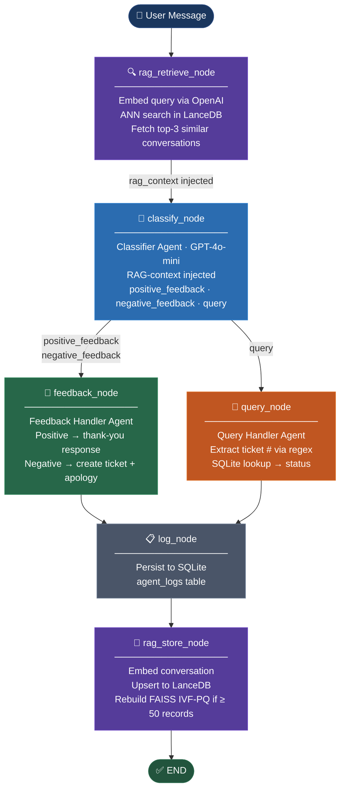
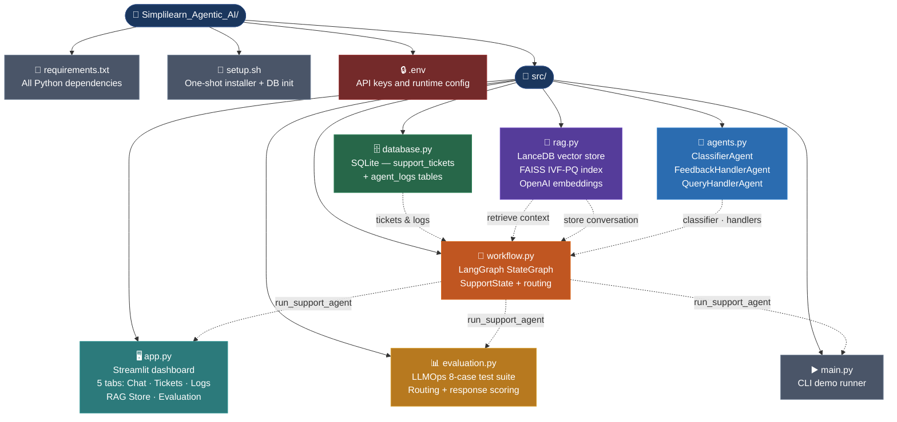

# Banking Customer Support AI Agent

A production-grade **multi-agent GenAI system** for banking customer support, built with **LangGraph**, **LanceDB**, **FAISS**, and **OpenAI**. The system classifies incoming customer messages, routes them to specialised agents, generates personalised responses, manages support tickets, and stores every interaction as a vector embedding for RAG-augmented retrieval.

---

## Table of Contents

1. [Project Overview](#1-project-overview)
2. [Architecture](#2-architecture)
3. [Project Structure](#3-project-structure)
4. [Setup & Installation](#4-setup--installation)
5. [Configuration](#5-configuration)
6. [Running the Project](#6-running-the-project)
7. [Agent Design](#7-agent-design)
8. [RAG Retrieval System](#8-rag-retrieval-system)
9. [Database Schema](#9-database-schema)
10. [Evaluation & Test Dataset](#10-evaluation--test-dataset)
11. [Streamlit UI](#11-streamlit-ui)
12. [Sample Use Cases](#12-sample-use-cases)

---

## 1. Project Overview

Modern banking platforms receive a high volume of customer interactions spanning complaints, praise, and status enquiries. This project implements a **multi-agent AI assistant** that:

- **Classifies** every incoming message as `positive_feedback`, `negative_feedback`, or `query`
- **Routes** each message to the correct specialist agent
- **Generates** empathetic, context-aware responses using an LLM
- **Manages tickets** — creates new tickets for complaints, looks up existing tickets for queries
- **Remembers past interactions** via a vector RAG store so agents become smarter over time
- **Logs and evaluates** every interaction for LLMOps visibility

---

## 2. Architecture

### LangGraph Workflow (directed state graph)



### Component Map

| Component | Technology | Role |
|-----------|-----------|------|
| Orchestration | LangGraph `StateGraph` | Routes messages through the agent pipeline |
| LLM | OpenAI GPT-4o-mini | Classification, response generation |
| Embeddings | OpenAI `text-embedding-3-small` (1536-dim) | Vector representation of conversations |
| Vector Store | LanceDB (on-disk, `.lancedb/`) | Persistent conversation memory |
| ANN Index | FAISS IVF-PQ (via LanceDB) | Fast approximate nearest-neighbour search |
| Ticket DB | SQLite (`support_tickets.db`) | Structured ticket & log storage |
| UI | Streamlit | Interactive chat dashboard |

---

## 3. Project Structure



---

## 4. Setup & Installation

### Prerequisites

- Python 3.11+
- An OpenAI API key

### One-command setup

```bash
bash setup.sh
```

The script performs these steps automatically:

1. Verifies Python and pip are available
2. Upgrades pip to the latest version
3. Installs all dependencies from `requirements.txt`
4. Creates a `.env` template (if not already present)
5. Initialises the SQLite database with seeded sample tickets

### Dependencies (`requirements.txt`)

| Package | Version | Purpose |
|---------|---------|---------|
| `langgraph` | ≥ 0.2.0 | Multi-agent graph orchestration |
| `langchain` | ≥ 0.2.0 | LLM abstraction layer |
| `langchain-openai` | ≥ 0.1.0 | OpenAI chat + embedding models |
| `langchain-community` | ≥ 0.2.0 | Community integrations |
| `openai` | ≥ 1.0.0 | Direct OpenAI API client |
| `lancedb` | ≥ 0.6.0 | On-disk vector database |
| `faiss-cpu` | ≥ 1.8.0 | FAISS library for IVF-PQ indexing |
| `pyarrow` | ≥ 14.0.0 | Columnar storage backend for LanceDB |
| `numpy` | ≥ 1.26.0 | Embedding normalisation |
| `streamlit` | ≥ 1.35.0 | Interactive web dashboard |
| `pandas` | ≥ 2.0.0 | Tabular data display |
| `python-dotenv` | ≥ 1.0.0 | `.env` file loading |
| `tiktoken` | ≥ 0.7.0 | Token counting for prompts |

---

## 5. Configuration

Edit the `.env` file created by `setup.sh`:

```dotenv
# Required: your OpenAI API key
OPENAI_API_KEY=sk-...

# Optional: OpenAI model (default: gpt-4o-mini)
OPENAI_MODEL=gpt-4o-mini

# Optional: SQLite database path (default: support_tickets.db)
DB_PATH=support_tickets.db

# Optional: LanceDB directory (default: .lancedb)
LANCEDB_URI=.lancedb
```

---

## 6. Running the Project

### Streamlit UI (recommended)

```bash
streamlit run src/app.py
```

Opens on `http://localhost:8501` with five tabs: Chat, Tickets, Logs, RAG Store, Evaluation.

### CLI Demo

```bash
python3 src/main.py
```

Runs five pre-defined example messages through the full pipeline and prints results to stdout.

### Evaluation only

```bash
python3 src/evaluation.py
```

Runs the 8-case test suite and prints a detailed classification + scoring report.

---

## 7. Agent Design

### Classifier Agent (`src/agents.py` → `classifier_agent`)

- **Input:** raw user message + optional RAG context string
- **Model:** GPT-4o-mini with a strict system prompt
- **Output:** one of `positive_feedback`, `negative_feedback`, `query`
- **Fallback:** keyword heuristic used when LLM response is not a valid label

System prompt instructs the LLM to use any retrieved past-conversation context to improve classification accuracy (e.g., if a semantically similar past message was labelled as `query`, that signal is weighted).

---

### Feedback Handler Agent (`feedback_handler_agent`)

Triggered for both `positive_feedback` and `negative_feedback`.

**Positive Feedback path:**
- Passes customer name and message to GPT-4o-mini with a warm, appreciative system prompt
- RAG context is used as a style/tone reference
- Returns a personalised thank-you message

**Negative Feedback path:**
- Generates a unique 6-digit ticket ID (collision-checked against SQLite)
- Inserts a new `Unresolved` ticket into `support_tickets`
- Passes complaint to LLM with an empathetic system prompt containing `{{TICKET_ID}}` placeholder
- Replaces placeholder with actual ticket number in the final response
- RAG context is used to acknowledge complaint patterns without referencing specific prior customers

Response format:
```
We apologize for the inconvenience. A new ticket #[TicketNumber] has been
generated, and our team will follow up shortly.
```

---

### Query Handler Agent (`query_handler_agent`)

Triggered for `query` classification.

- Extracts a 6-digit ticket number from the message using regex (`\b\d{6}\b`)
- Queries the `support_tickets` SQLite table
- Returns the ticket status, or a polite "not found" message if the ticket does not exist
- RAG context optionally surfaces related past ticket interactions

Response format:
```
Your ticket #[TicketNumber] is currently marked as: [Status].
```

---

## 8. RAG Retrieval System

The RAG system (`src/rag.py`) gives every agent access to semantically similar past conversations as grounding context, improving response accuracy and consistency over time.

### Embedding

- **Model:** `text-embedding-3-small` (OpenAI)
- **Dimension:** 1536 float32 values
- **Normalisation:** L2-normalised before storage so cosine similarity equals dot-product distance

### Vector Store — LanceDB

| Property | Value |
|----------|-------|
| Storage | On-disk, `.lancedb/` directory |
| Table | `conversations` |
| Backend | Apache Arrow / Lance columnar format |
| Schema | `id`, `user_message`, `classification`, `response`, `agent_used`, `ticket_id`, `timestamp`, `vector` |

### FAISS IVF-PQ Index

| Property | Value |
|----------|-------|
| Index type | IVF-PQ (Inverted File with Product Quantisation) |
| Metric | Cosine similarity |
| `num_partitions` | `⌊√N⌋` (dynamic, grows with data) |
| `num_sub_vectors` | 8 (1536 ÷ 8 = 192 — divides evenly) |
| Build trigger | Automatically when record count ≥ 50 |
| API | `lancedb.index.IvfPq` (≥ 0.6) with legacy keyword-API fallback |

Below 50 records, LanceDB falls back to exact brute-force search with no loss of correctness.

### Retrieval Flow

```
Incoming message
      │
      ▼
OpenAI text-embedding-3-small
      │
      ▼ 1536-dim L2-normalised vector
      │
      ▼
LanceDB ANN search (FAISS IVF-PQ)
      │
      ▼ top-3 most similar past conversations
      │
format_rag_context()
      │
      ▼ formatted context block appended to system prompt
      │
ClassifierAgent / FeedbackHandler / QueryHandler
```

### Storage Flow (after each interaction)

```
Completed SupportState
      │
      ▼
_get_embedding(user_message)   ← OpenAI API call
      │
      ▼
LanceDB table.add([row])       ← append to .lancedb/conversations/
      │
      ▼
if len(table) >= 50:
    table.create_index(IvfPq)  ← rebuild FAISS index
```

### Context Format Injected into Prompts

```
--- Relevant past interactions (use for context, do NOT copy verbatim) ---
[1]  [similarity: 0.94]
  Prior message  : "My credit card hasn't arrived yet."
  Classification : negative_feedback
  Response given : "We apologize... ticket #823441 has been generated..."
[2]  [similarity: 0.87]
  ...
--- End of context ---
```

---

## 9. Database Schema

### SQLite — `support_tickets.db`

**`support_tickets` table**

| Column | Type | Description |
|--------|------|-------------|
| `ticket_id` | TEXT PK | Unique 6-digit ticket number |
| `customer_name` | TEXT | Customer's name |
| `issue` | TEXT | Original complaint text |
| `status` | TEXT | `Unresolved` / `In Progress` / `Resolved` |
| `created_at` | TEXT | UTC ISO-8601 timestamp |
| `updated_at` | TEXT | UTC ISO-8601 timestamp |

**Seeded sample tickets**

| Ticket ID | Customer | Issue | Status |
|-----------|----------|-------|--------|
| 650932 | Alice Johnson | Net banking login failure | Resolved |
| 784521 | Bob Smith | Debit card replacement delayed | In Progress |
| 123456 | Carol White | UPI transaction failed | Unresolved |
| 999001 | David Lee | Credit card statement error | Resolved |
| 555444 | Eve Davis | Loan EMI deducted twice | In Progress |

**`agent_logs` table**

| Column | Type | Description |
|--------|------|-------------|
| `id` | INTEGER PK | Auto-increment |
| `timestamp` | TEXT | UTC ISO-8601 |
| `user_message` | TEXT | Original customer message |
| `classification` | TEXT | Agent classification result |
| `agent_used` | TEXT | `FeedbackHandlerAgent` or `QueryHandlerAgent` |
| `response` | TEXT | Final response sent to customer |
| `ticket_id` | TEXT | Ticket ID if created/queried |
| `success` | INTEGER | `1` = success, `0` = failure |

### LanceDB — `.lancedb/conversations`

Stores vector embeddings of every processed conversation. Schema matches `_conversation_schema()` in `rag.py` with an additional `vector` field (fixed-size list of 1536 float32 values).

---

## 10. Evaluation & Test Dataset

The evaluation module (`src/evaluation.py`) provides an 8-case test suite covering all three classification categories.

### Test Cases

| # | Customer | Message | Expected Class | Domain |
|---|----------|---------|---------------|--------|
| 1 | Alice | "Thanks for sorting out my net banking login issue." | `positive_feedback` | Login resolved |
| 2 | Bob | "Your service is amazing! The loan approval was so fast." | `positive_feedback` | Loan approval |
| 3 | Carol | "My debit card replacement still hasn't arrived after 3 weeks." | `negative_feedback` | Card delivery |
| 4 | David | "I was charged twice for the same transaction. This is unacceptable." | `negative_feedback` | Duplicate charge |
| 5 | Eve | "Could you check the status of ticket 650932?" | `query` | Ticket lookup |
| 6 | Frank | "What is the current status of my complaint number 123456?" | `query` | Complaint status |
| 7 | Grace | "I'm extremely disappointed with the ATM service." | `negative_feedback` | ATM complaint |
| 8 | Henry | "The mobile app works perfectly now. Great job!" | `positive_feedback` | App praise |

### Scoring Methodology

**Routing accuracy** — binary per test case: 1 if `actual_classification == expected_classification`, else 0.

**Response quality score** (0.0 – 1.0) — keyword-based heuristic:

| Classification | Scored Keywords | Bonus |
|---------------|----------------|-------|
| `positive_feedback` | thank, happy, delight, appreciate, assist, kind | +0.10 per hit (base 0.50) |
| `negative_feedback` | apologize, sorry, understand, inconvenience, help, support, team | +0.10 per hit; +0.20 if ticket `#` present |
| `query` | ticket, marked as, status, # | +0.15 per hit (base 0.50) |

**Aggregate metrics reported:**
- Total test cases
- Routing success rate (%)
- Average response quality score
- Per-class classification accuracy

---

## 11. Streamlit UI

Five-tab dashboard (`src/app.py`):

| Tab | Description |
|-----|-------------|
| 💬 **Chat** | Submit a message, see classification, RAG context retrieved, and agent response |
| 🎫 **Tickets** | Browse all support tickets with colour-coded status |
| 📋 **Logs** | Full agent interaction log with success/failure metrics |
| 🧠 **RAG Store** | Browse all LanceDB embeddings, record counts by category |
| 📊 **Evaluation** | Run the 8-case test suite and view detailed scoring results |

### Sidebar

- **Customer Name** — personalises agent responses
- **Sample Messages** — one-click pre-fill for each agent path
- **Agent Flow** — visual summary of the 6-step pipeline

---

## 12. Sample Use Cases

**Example 1 — Positive Feedback**

```
User    : "Thanks for sorting out my net banking login issue."
Path    : rag_retrieve → classify → feedback_node (positive)
Response: "Thank you for your kind words! We're happy to support you."
```

**Example 2 — Negative Feedback**

```
User    : "My debit card replacement still hasn't arrived."
Path    : rag_retrieve → classify → feedback_node (negative)
Ticket  : #784521 (new, inserted into SQLite)
Response: "We apologize for the inconvenience. A new ticket #784521 has been
           generated, and our team will follow up shortly."
```

**Example 3 — Ticket Query**

```
User    : "Could you check the status of ticket 650932?"
Path    : rag_retrieve → classify → query_node
Response: "Your ticket #650932 is currently marked as: Resolved."
```

**RAG in action (after several interactions)**

```
User    : "My ATM card hasn't been delivered yet."
RAG     : retrieves [similarity: 0.91] "My debit card replacement still
           hasn't arrived" → negative_feedback → empathetic response
Effect  : Classifier confidence boosted; response tone informed by
           prior empathetic handling of similar card delivery complaints.
```

