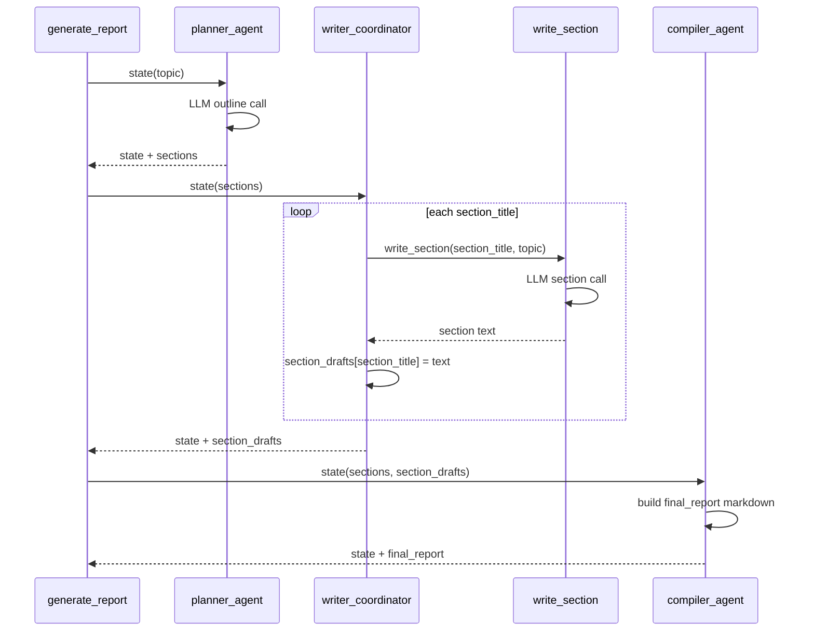

# Report Generator Workflow Diagram

## Flowchart

```mermaid
flowchart LR
    S([Start: generate_report(topic)])
    I[Initialize ReportState:\n- topic\n- sections = []\n- section_drafts = {}\n- final_report = ""]
    P[Planner Agent\nplanner_agent(state)]
    O[Outline Produced\nsections: 3-4 titles]
    W[Writer Coordinator\nwriter_coordinator(state)]
    L{For each section}
    WS[Writer Agent\nwrite_section(section_title, topic)]
    SD[Save draft in section_drafts]
    C[Compiler Agent\ncompiler_agent(state)]
    R[Assemble Markdown Report\ntitle + all section drafts]
    E([End: return final_report])

    S --> I --> P --> O --> W --> L
    L --> WS --> SD --> L
    L --> C --> R --> E
```

## Sequence Diagram


